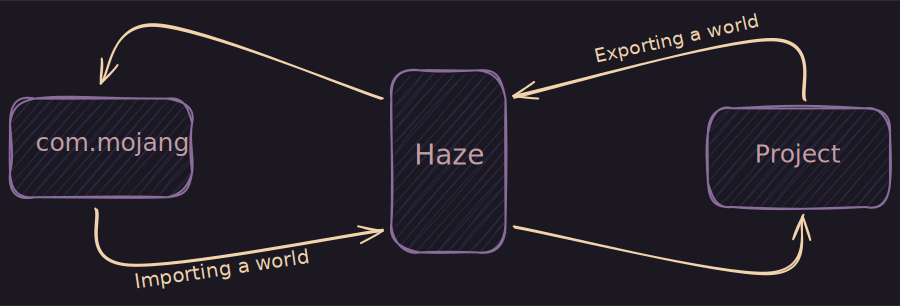

<h2>
  <span>Haze</span>
  
</h2>

> Dead simple world management tool for Minecraft Bedrock

Haze follows
[Regolith's philosophy](https://bedrock-oss.github.io/regolith/guide/what-is-regolith)
of keeping your project files outside of `com.mojang`, and further extends it to
include worlds too. This can be particularly useful for source control when
working within a team.



An example workflow could be like this:

1. You pull in some changes from a git repository
2. You run `haze export some_wip_world` to export the world to `com.mojang`
3. You modify the world in Minecraft
4. After you're done, you run `haze import some_wip_world` to import the world
   into your project
5. You commit and push the changes you made

Additionally, this workflow allows for operations such as quick
reloading/reverting of a world state to a previous one by running
`haze export --overwrite some_existing_world`.

## Installation

### Windows

A Powershell installation script is available. I'd recommend taking a good look
at this script before running it.

```powershell
irm https://raw.githubusercontent.com/arexon/haze/main/scripts/install.ps1 | iex
```

Alternatively, you can download a pre-built binary from the
[releases](https://github.com/arexon/haze/releases) page.

### Linux & macOS

There's no installation scripts for either OSs, but pre-built binaries are
available in the [releases](https://github.com/arexon/haze/releases) page. From
there you can try to install Haze manually.

### Nix

```console
# Try out with
nix run github:arexon/haze

# ..or create a devshell
nix shell github:arexon/haze
```

If you're using flakes:

```nix
# flake.nix
{
  inputs = {
    haze.url = "github:arexon/haze";
  };
}
```

### Building from source

Depending on which OS you're on, make sure you either have `rustup` or `cargo`
installed.

1. Clone the repository:

```console
git clone https://github.com/arexon/haze.git --depth 1
cd haze
```

2. Build and install

```console
cargo install --path .
```

Refer to
[`cargo install` docs](https://doc.rust-lang.org/cargo/commands/cargo-install.html)
for more info.

## Usage

You must have a `config.json` file at the root of your project and it must
follow the
[Project Config Standard](https://github.com/Bedrock-OSS/project-config-standard).
If you're using [Regolith](https://bedrock-oss.github.io/regolith/),
[bridge.](https://bridge-core.app/), or
[Dash compiler](https://github.com/bridge-core/deno-dash-compiler) you should
already be familiar with it.

Define where Haze should look for your worlds. This can be a glob pattern or a
direct path.

```diff
// config.json
{
  {
    "name": "my-project",
+   "worlds": [
+     "./worlds/*",
+     "./testing_worlds/playground"
+   ],
    "packs": {
      "behaviorPack": "./packs/BP",
      "resourcePack": "./packs/RP"
    }
  }
}
```

### The `com.mojang` directory

If you're on Windows, Haze will try to look for the `com.mojang` directory for
stable versions of Minecraft by default. You can change this with
`haze --minecraft-version [VERSION]` and then supplying `preview` or
`education`.

You can also define an arbitrary path to `com.mojang` by setting the
`COM_MOJANG` environment variable. Doing so will override the
`--minecraft-version` option.

On Unix systems, the `--minecraft-version` option isn't available and you must
set `COM_MOJANG` instead.

### Exporting, importing, and listing worlds

Let's say your project has the following directory structure:

```yaml
my-project
|-- config.json
|-- packs/
`-- worlds
    |-- bar/
    `-- foo/
```

You can export `foo` like so:

```console
haze export foo
```

And then import it back:

```console
haze import foo
```

If `foo` is also present in `com.mojang`, you'll have to overwrite it:

```console
haze export --overwrite foo
```

You can operate on multiple worlds as well:

```console
haze export --overwrite foo bar
haze import foo bar
```

And lastly, you can list all worlds stored locally in your project _and_ in
`com.mojang`:

```console
haze list
```

You can refer to `haze help` for more info.

## License

Haze is licensed under MIT. Check the [license file](LICENSE) for more info.
